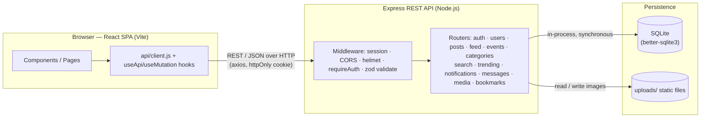
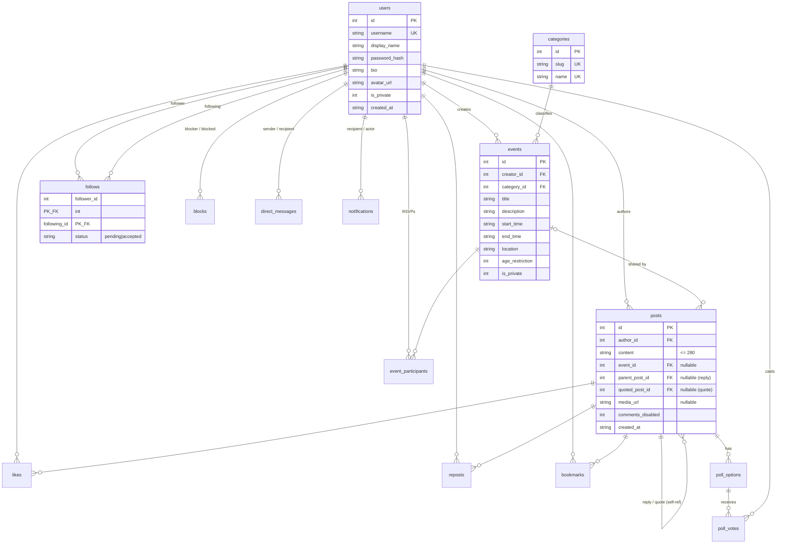

# Rally — Design Document

*Event-centered microblogging. ~1,000 words + diagrams.*

---

## 2.1 Application Overview

Rally is an **event-centered microblogging platform**: short posts + follows + a
reverse-chronological feed, organized around **public events** users create and **join** via a
participate button, with a **calendar** for date-based discovery and **fixed categories**
(instead of hashtags). It is for people who want to meet others around shared interests
(sports, anime, music, gaming, food, study).

What makes it more than CRUD: the core flow combines social posting, an approval-gated social
graph, event discovery, and participation — a post can *share* an event, the calendar
aggregates events by date and shows what you're attending, and trending surfaces the most
engaging events in the last 24 hours.

**Chosen extended features (and why).** Rally goes well past the required minimum of two
extended features because each one directly serves the core loop of *discovering an event and
actually showing up*:

- **Media attachments** — an event post can carry a flyer or photo, making it scannable and
  more shareable than plain text.
- **Reposts** push an event beyond the creator's own followers, and **Likes** provide the
  lightweight engagement signal that powers **Trending** (the most-engaged events and posts in
  the last 24 hours) — the app's primary discovery surface.
- **Replies** turn each post into a discussion thread, so prospective attendees can ask
  logistics ("what time?", "where exactly?") before committing.
- **Bookmarks** let users privately save events they're still considering, kept separate from
  the public "participate" action.
- **Search** and **fixed categories** (a deliberate, curated substitute for free-form
  `#hashtags` — sports, anime, music, gaming, food, study) make browsing predictable and keep
  the interest graph clean.
- **Notifications** close the loop: users hear when an event they joined changes, or when their
  own posts get engagement, pulling them back into the app.

Together these turn a plain CRUD feed into an event-discovery product — you *find* events by
category / search / trending, *discuss* them via replies, *save* them via bookmarks, and get
*pulled back* by notifications.

## 2.2 Architecture Diagram

The **React (Vite) single-page app** is the only client. It talks to the **Express REST API**
exclusively over HTTP (axios, credentialed session cookie) — there are **no WebSockets and no
direct database access from the browser**. Express is the only process that touches **SQLite**,
which it does directly and synchronously via better-sqlite3. Sessions are persisted in that same
SQLite database (via `better-sqlite3-session-store`), and uploaded images are written to a local
`uploads/` directory served as static files.

Solid REST/JSON is the *only* client↔server channel; every server↔data edge is a direct,
in-process call. In production the browser reaches Express through a Vercel rewrite that proxies
`/api/*` to the Render backend, keeping the API first-party so the session cookie works without
third-party-cookie friction.

## 2.3 Data Model

`backend/db/schema.sql` defines **14 tables** plus **2 FTS5 virtual tables** (`posts_fts`,
`events_fts`) that mirror post/event text for full-text search. Key modeling decisions:

- **Replies and quotes are just posts** — a reply sets `parent_post_id`, a quote sets
  `quoted_post_id` (both self-references on `posts`). No separate reply/quote tables.
- **A post shares an event** through a nullable `event_id` foreign key.
- **Engagement counts are derived** with `COUNT()` at read time, never stored columns.
- **The social graph is `follows(follower_id, following_id, status)`** where `status` is
  `pending` or `accepted`, which is what implements approval-gated private accounts.
- **Polls** are a post plus rows in `poll_options` / `poll_votes`; **direct messages**,
  **blocks**, and **notifications** each get their own table.

*(Also present, omitted from the diagram for readability: `blocks`, `likes`, `reposts`,
`bookmarks`, `event_participants`, `direct_messages`, `notifications`, `poll_options`,
`poll_votes` — each a join/child table keyed on the users/posts/events above.)*

## 2.4 API Design

Routes are grouped by resource (`auth`, `users`, `posts`, `feed`, `events`, `categories`,
`search`, `trending`, `notifications`, `messages`, `media`, `bookmarks`), each in its own file
under `backend/routes/`. Authentication is an **httpOnly session cookie**: a `requireAuth`
middleware returns **401** on protected routes, while `optionalAuth` attaches the viewer id when
present so public routes can still personalize. Every `POST`/`PUT` body is validated with **zod**
(→ 400 with the failing issues), and a toggle on a non-existent `:id` returns 404.

Two non-obvious decisions: (1) the **home feed** is a SQL `UNION` of a user's own top-level posts
and reposts made by the accounts they *accepted*-follow, ordered by time and capped — reposts
carry a `repostedBy` marker so the client can render "reposted by @x". (2) A single shared
**visibility predicate** (`lib/visibility.js`) is `AND`-ed into every post- and event-returning
query, so private accounts and private events are filtered uniformly in one place rather than
re-implemented per route. Post serialization is likewise centralized in `lib/postQuery.js` so all
endpoints return the same rich shape with derived counts.

## 2.5 Influence from Real Platforms

**Approval-gated private accounts**, taken directly from Instagram's and X/Twitter's *protected
accounts*. On those platforms, following a private account is not self-serve: it creates a
*request* the owner must approve before any private content becomes visible. We modeled this with
`follows.status` (`pending` → `accepted`) rather than a plain follow edge, and the accept action
flips the status; the same shared visibility predicate then treats an `accepted` follower as
authorized to see private posts and private events. This one column drives the follow button
states ("Follow" / "Requested" / "Following"), the follow-requests inbox, and the entire private
content gate — a small schema decision that mirrors a real privacy model end-to-end.

## 2.6 Trade-offs and Scope Decisions

1. **Derived counts vs denormalized counters.** Production platforms cache like/repost/reply
   counts in denormalized columns or a store like Redis because counting on every read doesn't
   scale to millions of rows. We `COUNT()` on read instead — correct, always-consistent, and
   trivial at course scale, and it's required anyway for the 24-hour trending window (which counts
   only *recent* engagement, something a single stored total can't express).

2. **Polling over REST vs real-time push.** Twitter/Mastodon stream new posts and notifications
   over WebSockets/SSE. We deliberately refetch over REST to honor the assignment's REST-only
   separation constraint and to keep the system a single, debuggable request/response model. The
   cost is that new content appears on refetch rather than instantly — acceptable for our scope.

3. **Fixed categories vs free-form hashtags.** Open platforms index arbitrary `#hashtags`, which
   requires tokenizing post text and maintaining an ever-growing tag index. We chose a small
   curated set of six categories attached to *events*. This keeps the interest graph clean and
   discovery predictable, at the cost of user-defined topics — a fair trade for an event-focused
   product where the taxonomy is known in advance.
